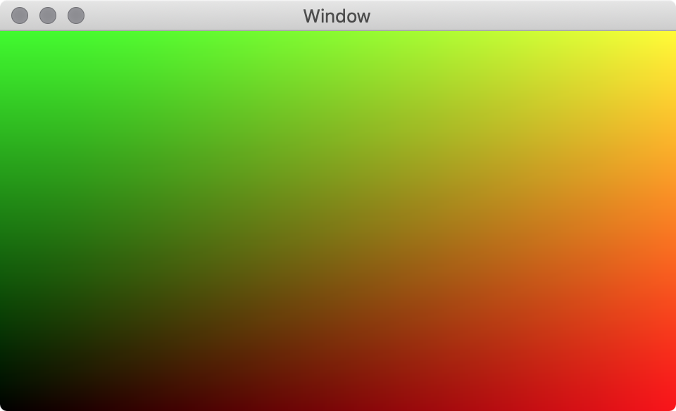

参考資料
: [Rendering graphics with MetalKit Swift4 (Part 1)](https://www.clientresourcesinc.com/2018/04/30/rendering-graphics-with-metalkit-swift-4-part-1/)

実行例
: 

---

# 画素シェーダの `point_coord` 座標系について

この例題ではふたつの三角形を描画し、その内側のピクセルについて画素シェーダで色を塗っている。画素シェーダは所属する三角形の頂点からの相対位置に応じて色を選択するため、この相対位置についての理解は重要だ。

三角形△αβγを描くときに、頂点バッファに頂点α, β, γの順番に与えたとする。このとき、座標系はベクトルγαとγβで規定されるらしい。この作例では、頂点バッファの最初の３点は左下に位置する三角形（△ABC）の３頂点の座標{A = (1, -1), B = (-1, 1)  C = (-1, -1)}を、続く３点は右上に位置する三角形（△DAB）の３頂点の座標{B = (-1, 1), A = (1, -1), D = (1, 1)}を与えている。左下の三角形の場合、座標系を規定するベクトルを正規化したものは順に (1, 0) と (0, 1) となり、標準的なX軸とY軸に合致する。各画素の`point_cood`はこの座標系における相対座標となる。つまり、相対座標系において頂点A, B, Cはそれぞれ(1, 0), (0, 1), (0, 0)と位置を占める。

一方、△BADについては、座標系を規定するベクトルを正規化したものは順にDB = (-2, 0) → (-1, 0), DA = (0, -2) → (0, -1) となり、通常の座標軸と逆向きとなる。これらの向きを反転し、原点にあたるDの位置を(1, 1)に据えれば、△ABCと△BADを組み合わせて正方形を構成できるので都合がよい。このために画素シェーダでは、描画する画素がいずれの三角形に含まれるかを確認し、右上の場合には必要な変換 (`uv = 1 - uv`、すなわち `uv.xy = float2(1, 1) - uv.xy`) を施している。

この変換の正しさは画素の相対座標 `uv` に応じた色づけをした結果、得られた出力における配色がふたつの三角形について滑らかなグラデーションとなったことで確認できる。

# 反省

## 何も表示されない！

頂点バッファを準備するところで、つまらないミスをした。気づくまでにかなり苦労した。本来、以下が正しい。([頂点バッファの初期化](x-source-tag://vertexBufferInitialization))

`vertexBuffer = device.makeBuffer(bytes: vertices, length: MemoryLayout<Vertex>.stride * vertices.count, options: [])`

それに対して以下のように頂点の個数を乗ずるのを忘れていたのが敗因。

`vertexBuffer = device.makeBuffer(bytes: vertices, length: MemoryLayout<Vertex>.stride, options: [])`

この結果、バッファには最初の1頂点分のデータだけが供給された。当然、三角形を描くには少なくとも3頂点分のデータが必要なので、これでは足りない。このため画面には何も描かれなかった。

バッファにデータが足りないことの確認は、GPU デバッガでバッファの内容を眺めるのが最も簡単だと思う。このことに気づけば  `makeBuffer` の引数に問題があることに思いが至るだろう。

### 「何も表示されない」場合の教訓

- まず GPU デバッガ（カメラのアイコン）を起動する。

- カメラがクリックできないということは、`MTKView` が読み込まれていない可能性を疑え。`MTKView` の `init` に `print` でもいれて確認するとよい。

- 次に疑うのは、頂点バッファが正しく GPU に渡っていること。GPU デバッガで `Buffer` をダブルクリックすれば、シェーダに渡っているバッファの内容を簡単に確認できる。指定しただけの頂点が届いていることを確認すること。
